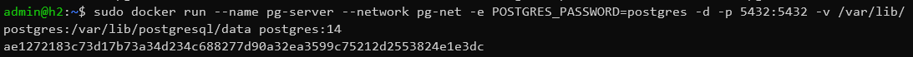

создадим виртуальную машину в ЯО с ubuntu 20.04

подключимся к ней по ssh

установили докер командой `apt-get instal docker.io`

создали папку `/var/lib/postgres`

создали сеть для докера

создали сервер с пострес 14

проверяем что контейнер запущен и смотрим что в смонтированой `/var/lib/postgres` появились данные докера

собираем образ с клиентом к докеру

запускаем контейнер с клиентом

подключаемся к контейнеру с клиентом и с помощью psql к базе в другом контейнере

создаем табличку и вставляем нексколько записей

с локальной машины подключаемся к базе в контейнере, трудностей не возникло так как мы уже прокидывали порт от pg

стопаем и удаляем контейнер с базой

поднимаем его заного

подключаемся к клиенту и проверяем, что всё на месте

Данные сохранились так как мы смонтировали вольюм на ВМ куда они и писались с контейнера с базой. По этому при удалении контейнера данные остались.
