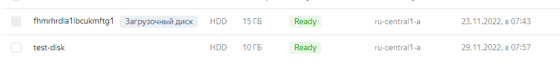

- создадим табличку и добавим запись на первой ВМ в ЯндексОблаке
  

- добавим диск
  

- видим что диск появился

- попытки партиционировать и смонтировать диск
  

- после монтирования перезагрузим машину и видим что он слетел
  

- добавим диск в конфиг

- снова перезагрзим, теперь диск не слетает
  

- поменяем владельца директории на монтированом диске

- перенесем папку `/var/lib/postgresql/14` в смонтированный диск `/mnt/vdb1`, видим что постгрес больше не запускается
  

- поменяем конфиг `data_directory` в `/etc/postgresql/14/main/postgresql.conf`
  

- теперь постгрес запустился, проверяем что данные видны
  

- (*) создал еще одну ВМ, отключил диск от первой ВМ в ЯО и подключил к новой. Так как диск уже размечен осталось только смонтировать его. Удалил папку `/var/lib/postgresql/` и поменял конфиг `data_directory` в `/etc/postgresql/14/main/postgresql.conf`, проверяем видны ли данные, и они видны.
  
